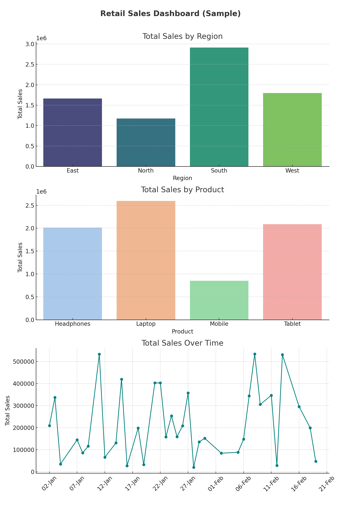

# Retail-Sales-Dashboard
Excel-based sales analysis dashboard for a retail company
# 🛍️ Retail Sales Dashboard (Excel)

## 📂 Dataset Overview:
This dashboard analyzes retail sales data including:
- Date, Region, Product, Category, Quantity, Unit Price, Total Sales

## 📊 Tools Used:
- Microsoft Excel (Pivot Tables, Charts, Slicers)

## 📈 Dashboard Features:
- Total Sales by Region
- Top-Selling Products
- Monthly Sales Trend
- Interactive filters by Category & Region

## 💡 Skills Shown:
- Data Analysis
- Dashboard Design
- Visualization
- Excel Automation

 ## 🖼️ Dashboard Preview:

